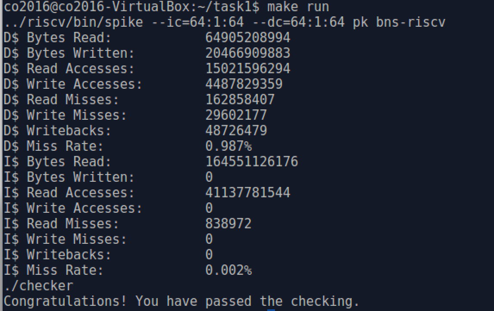
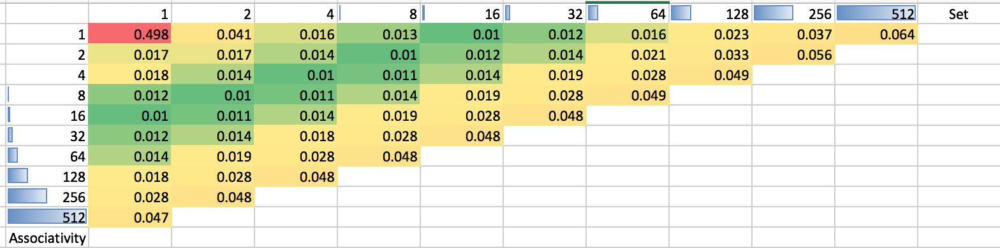
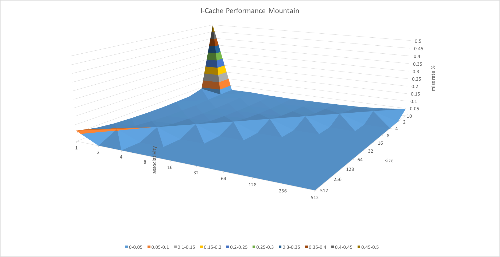
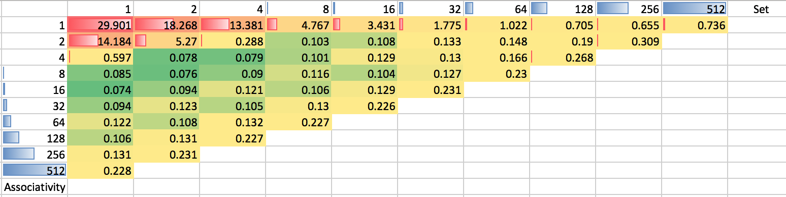
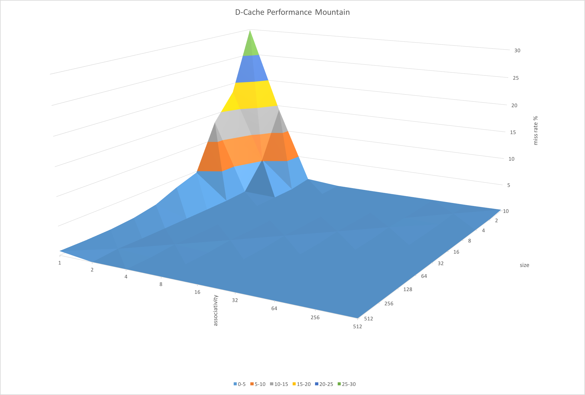
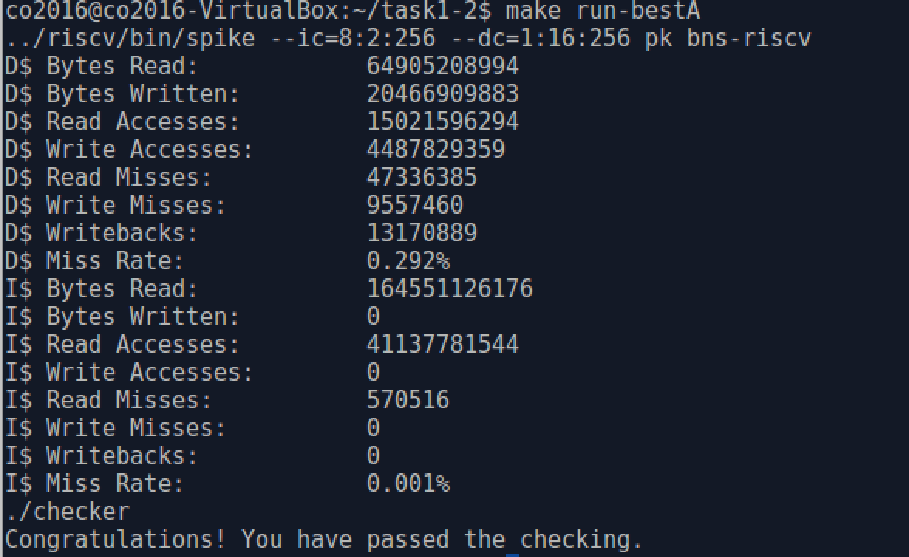
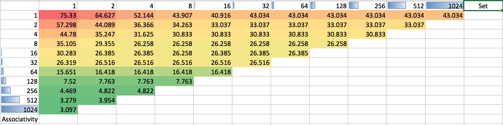
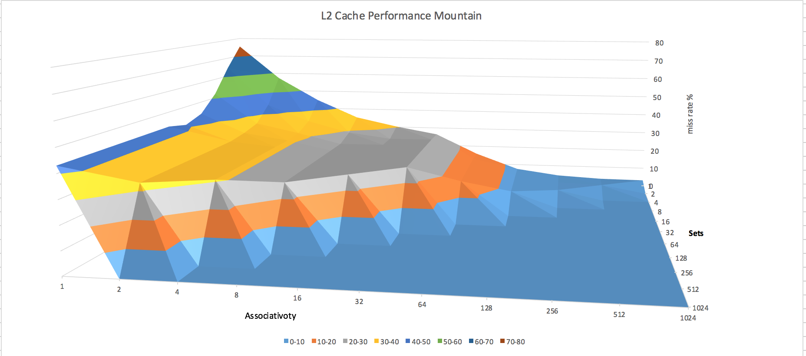
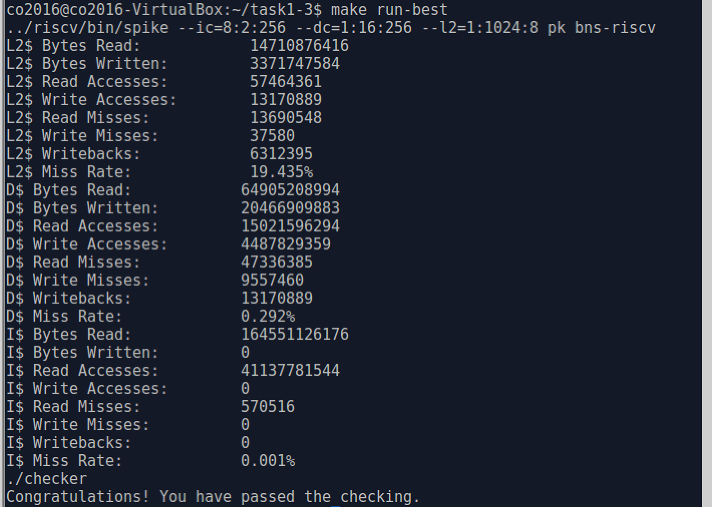

# CO-Task1 Report

*
高宇翔 0440164 | 郭力豪 0440165 | 姚人杰 0440160 | 张宇飞 0440171
*

---

## Task1.1 Program Modification

In Task 1.1, the main focus is on program modification to avoid wasted memory access andreduce memory access misses.

### 1.1 Starter

First, the origin code is executed : insert result For a starter, the complicated twoloops are merged and reordered. Reordering the index exploits spatial locality of imageconvolution. A slight improvement is achieved :

| instance  | AccessTime  |    Ratio    |
| :-------: | :---------: | :---------: |
|  Origin   | 2.29113E+11 |      1      |
| MergeLoop | 2.16862E+11 | 1.056491536 |

Execution of program inspike is quite time-consuming, so reduced size ( 32x32 ) of origin images ( 1280x960 ) areused then to test each modification.

*Note. In the following tests, program is first checked on origin images running on host andthen tested with smaller images running on spike to get memory access information.*

 

 

 

### 1.2 Tests

*Each latter modification is an addition to former modification.* These tests were carried out on smaller images.

| Instance         | D-AccessTime | I-AccessTime | AccessTime  | RatioWithThe FormerInstance |
| ---------------- | ------------ | ------------ | ----------- | --------------------------- |
| MergeLoop        | 89077081.43  | 76973026.18  | 166050107.6 | 1                           |
| TempVariable     | 62712695.13  | 41887572.72  | 104600267.9 | 1.587473063                 |
| ExpandGetIdx     | 64209425.54  | 40996627.22  | 105206052.8 | 0.99424192                  |
| RealNum          | 63134981.14  | 40990678.91  | 104125660   | 1.010375855                 |
| RealNum*         | 62335589.91  | 41884181.51  | 104219771.4 | 0.999096991                 |
| Specified        | 58746566.29  | 41089584.4   | 99836150.69 | 1.04390815                  |
| UnrollCheckPixel | 56284973.45  | 40742810.33  | 97027783.79 | 1.028943946                 |
| Unroll3          | 59883040.73  | 39484156.96  | 99367197.7  | 0.976456879                 |
| UnrollAll        | 62497835.44  | 34318785.78  | 96816621.22 | 1.002181057                 |

#### Description and analysing 

1. **MergeLoop** : In the original code, two loops were used to carry out the convolution, we merge them to avoid repeated loops. Merge loop is used as the unit performance as it is a slightly better version of origin showed in starter.

2. **TempVariable** : Use a temporary variable to store several same references of one same data reduces lots of memory accesses as the temp variable remain in register so memoryaccess is avoided and instruction accesses as calculation of memory addresses is avoided.

3. **ExpandGetIdx** : Small calculation like getIdx() is not suitable to use a single function to waste function references. However, result shows worse performance as the missesincreases while access count decreases. There might be some competition in usingregisters so in the follow test, some variable are changed to constant to avoid registerusing.

4. **RealNum** :  *( realnum (expanded) / realnum\* (not expanded) )*

   As stated above, by reducing register using, the benefit of expanding small function shows up. Changing variables like kernLen and weight to real numbers reduces some memory access. Although there is a drawback expanding `getIdx()`, when use real numbers with such modification, the performance is actually a 0.4% increase.

5. **Specified** : By pre-defining the information of image, the code is specified to the three given images. The performance is improved just like RealNum. Visible increase of 4% was resulted.

6. **UnrollCheckPixel** : `checkPixel()` was referenced many times in the deepest loop of the convolution function. Unrolling the loops `checkPixel()` would probably save a lot of time from looping and references. Loop in `checkPixel()` is first unrolled to check whether loop unrolling improves performance. The result shows improvement.

7. **UnrollMainLoop** : With a similar intention in the previous modification, we tried to unroll some of the main loops in the 2D convolution function. In instance *Unroll3* we unroll the deepest loop threefold, namely, it would execute three loops of original loop in one loop.In instance "UnrollAll" we unrolled the deepest loop. The result shows that total unrolling of first loop is better than threetimes unrolling. However, the result is not quite clear, so it should be tested on originimages.

### 1.3 Testify

*In the following tests, merge loop and unroll checkpixel() are default modifications.*

We test our code on smaller images, to check whether the result of testing is reliable, several tests using original images are carried out. Similar result can be derived from these results, so it is safe to say the test results are accurate:

| Instance               | D-AccessTime | I-AccessTime | AccessTime  | RatioWithOrigin |
| ---------------------- | ------------ | ------------ | ----------- | --------------- |
| Unroll3(TempVariable)  | 87024927353  | 48184131289  | 1.35209E+11 | 1.694510119     |
| Unroll3+(ExpandGetIdx) | 86580596112  | 47650445019  | 1.34231E+11 | 1.706856448     |
| Unroll3s(RealNum)      | 85572408531  | 47509839504  | 1.33082E+11 | 1.721590381     |
| Unroll3f(Specified)    | 78646873953  | 47583790637  | 1.26231E+11 | 1.815035347     |

As for the extent of loop unrolling : 

| Instance | D-AccessTime | I-AccessTime | AccessTime  | RatioWithOrigin |
| -------- | ------------ | ------------ | ----------- | --------------- |
| Unroll2  | 85708851562  | 57692666570  | 1.43402E+11 | 1.597703574     |
| Unroll3  | 83683207340  | 57554146700  | 1.41237E+11 | 1.622185007     |
| Unroll4  | 85528059307  | 57160234078  | 1.42688E+11 | 1.51983202      |

### 1.4 Final Result

Using the best modification ( Specified ), we know that unroll main loops should be somewhat fruitful, but we are not sure to what extent should we unroll them since that there is drawback in instruction misses when loops are unrolled. Unsure about the balancing point, we simply picked the best result from the three tests (NoUnrolling, Unrolled threefold, All Unrolled) we carried out, which is to completely unroll the nine loops of the deepest loop. 

| Instance              | AccessTime  | RatioOfImprovement |
| --------------------- | ----------- | ------------------ |
| UnrollAll(Specified)* | 1.18666E+11 | 1.930734356        |
| Unroll3f(Specified)   | 1.26231E+11 | 1.815035347        |
| NotUnroll(Specified)  | 1.29403E+11 | 1.77053618         |

The best result is full unrolling of the deepest loop : 

### 1.5 Ideal Result

Considering data access, the ideal performance of convolution is that each calculation of multiplication only involves RGB of pixel and corresponding filter mask and the ideal per-formance without convolution can be tested by commenting convolution function in mainloop :

| Instance           |     D-Read |  D-Write |   D-Access |
| :----------------- | ---------: | -------: | ---------: |
| IdealConvolution   | 2388787200 | 22118400 | 2410905600 |
| WithoutConvolution |   21011407 | 25725436 |   46736843 |
| IdealProgram       | 2409798607 | 47843836 | 2457642443 |

The ideal miss rate depends on the setting of cache. The best situation without specialcache tech is that all misses are only compulsory miss.

## Task1.2 Cache Basic Setting

Tests using the best codes in task 1.1 with smaller images are run under different cachesettings. ( I-Cache and D-Cache are independent ) Similar to task 1.1, the best setting is generated from tests with smaller images so the result is not guaranteed to be the best butprobably the best.

### 2.1 Performance Tests

#### I-Cache

Miss Rate with different `ic` configuration: 

#### D-Cache

Miss Rate with different `dc` configuration:  

#### Result

Results show that the L1 cache influences the program mainly by the size of block andreaches optimized setting depending on the program.

### 2.2 Final Result

The result shows certain performance improvement :

| Instance              | AccessTime  | RatioWithThe FormerInstance |
| --------------------- | ----------- | :-------------------------: |
| Origin                | 2.29021E+11 |              1              |
| UnrollAllf(Specified) | 1.18666E+11 |         1.929956199         |
| BestL1                | 77908638378 |         1.523146992         |

So the best L1 cache configuration would result in a 52% increase upon the best result of task 1.1, which is approximately 194% increase upon the original access time.

## Task1.3 L2 Cache

After the same procedure in task 1.2: The best result we can get is :

| Instance | AccessTime  | RatioWithTheFormerInstance |
| -------- | ----------- | :------------------------: |
| Origin   | 2.29021E+11 |             1              |
| BestL1   | 77908638378 |         2.9396098          |
| BestL2   | 64906916097 |        1.200313357         |

There is a 20% increase of performance upon the best result from task 1.2, which is approximately 253% increase upon the original performance.

It shows that the L2 cache influences the program mainly by the size of block when associativity is lowand then mainly by the associativity. The miss rate of L2 Cache is quite high becauseoptimization of L1 Cache puts pressure on L2 Cache so that 8K L2 Cache cannot fullyimprove performance. Combining L1 with L2 will possibly get a better result. However, the count of combinations will be large therefore is not doable

## Discussion 

### Reliability

An interesting phenomenon is the tests with smaller images shows almost the same trends comparing to results from original images. The ratio of writing access/reading access isalmost the same as well. When the access counts excluding convolution is relatively small,the performance mainly depends on convolution function. What makes the result is that theperformance depends mostly on the pattern of memory access rather than the scale of data.

### L1-L2 Caches

1. Cache Influences Results show that different level of caches influences performance indifferent ways. More specifically, they exploit locality of different types or to differentextend. L1’s block size influences most due to the ”unit” size of data in loop. However,when comes to L2 cache, the problem becomes how to avoid misses of the L1 misses,therefore, associativity shows significance here.
2. Cache Structures Except for the distinctions of different level caches, they influenceseach other as well. The most optimized design is not simply the summation of eachlevel cache’s optimization. Design of memory hierarchy is a design as a whole. Apossible solution to reduce the influence between different level of caches might beadditional techniques like prefetching. On the other hand, there are many methods totake the influence between different level of caches into account when setting.

#### Algorithm Improvements

Replacing  convolution with FFT for image blurring/sharpening would result in much faster execution, but possibly more memory access. The complexity of FFT is $N\times\log N$ while convolution is $N\times N$ . So the performance gain in the new alogorithm here is as significant as cache optimization. This will be an interesting approach to try.

#### Methodology

The analysis so far is largely based on experiment results. Though quantitative analysis ofeach function and its specific memory access pattern can be done but the exact behaviour ofCPU cannot be known so the memory access of program itself differs when it is put into realexecution on pipeline. However, with the help of *Cache Analyser*[^1] quantitative analysis may be reached.

### Alternative Tools

To analyse cache access behaviour of a program, there are many tools available. *Cache Analyser*[^1] is one of them. It can provide detailed information concerning instruction and data cache usage and help developer optimise them. It can record each hit and miss and helps the developer recognise the pattern of any inefficiency.

#### Automated Optimizer

There are many automated optimizer at different level[^2]. If the riscv compiler can supportdeeper level of optimization, the performance might be improved further.

## Feedback

1. This project is **too easy** and we hope TA can increase the difficulty next semester. We believe that next year's student will also find it so easy. 
2. TAs are **very nice** and the grade will be high, right?
3. Next time, maybe a smaller image will be better because it takes such a long time to run the program.
4. The most time we spent on is waiting for the program to run. And to get the best allocation of cache we have to test all the combination which take a lot of time.
5. When talking about whether this project is fun, if you give us more credit, yes, it is the best thing I’ve ever done.

[^1]: http://www2.lauterbach.com/doc/cacheanalyzer.pdf
[^2]: https://en.wikipedia.org/wiki/Program_optimization 